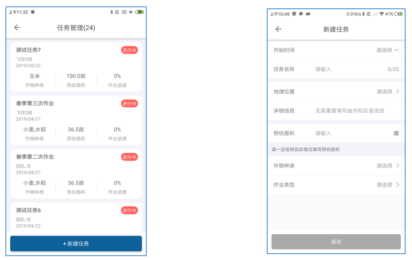

## APP使用说明

# 账户注册

用户可以通过农服植保地面站软件对植保无人机进行参数设置。地面站软件是一个Android应用，可以运行在任何Android手机或平板上。下载参考 [1.4 APP安装](#_1.4  APP安装)。

如下图所示，地面站主入口包含六个功能按钮：设置，测绘，手动作业，自动作业，管理，我的。

手动作业及自动作业需要先在管理里建立团队或者加入团队才能运用。

图 APP主界面

 

这里的账号角色分为3种：*制造商*、*企业运营人*及*个体运营人*。账号权限如下表所示：

表- 平台角色功能差异表

 

制造商和企业运营人账号必须在网页<http://agcloud.vk-fly.com>注册，个人运营人账号在农服APP-\>我的中注册。。

制造商账户：植保无人机制造厂家，可以管理所有该制造商生产出来的飞机，具有高级调参权限，制造商账户添加的内部员工账号也具有高级调参权限。

企业运营人账户：有合法的植保资质的植保公司，飞机绑定公司，可以分给公司员工；

个体运营人账户：购买或者使用飞机的个体用户，没有高级调参权限。

# 我的

图 APP我的信息

 

农服主界面点击我的进入此界面。在我的中可查看，账户信息，作业情况，以及农服版本信息等。

**作业亩数：**当前账号的作业亩数总和；

**飞行架次：**当前账号的飞行架次总和；

**作业时间：**当前账号的作业时间总和；

**警告信息：**用户操作出现错误会在这里给出提示，飞机的制造商和运营人可以看到有相关权限的所有飞机的警告信息。例如侵入禁飞区。

**公告信息：**用户了解最新平台及地面站的信息查看处，例如更新等信息时会在这里给出提示，无论制造商、运营人还是个体都需要随时关注公告。

图 我的个人信息 

 

点击 图 APP我的信息 中的②进入作业详情界面：可以查看所有作业轨迹，亩数等，短按某个架次可以进入飞行记录详情页面，长按屏幕可以多选N个架次数据在地图上显示，还可以选择日报或者一段时间内的作业轨迹。

图 我的飞行记录 

 

图 日报

 

# 管理

账号主体不同管理中所包含的内容有所不同。管理中包括：*设备管理，团队管理，员工管理，地块管理，地块作业记录，作业统计。*

图 管理

 

# 设备管理

点击设备管理，可以看到用户所有的飞机，如**图 设备管理**，页面上方的统计数据：*作业亩数、飞行架次、作业小时*，这些统计数据，是这些飞机从在本账户注册之日开始计算的。

对于新飞机来说，激活日期就是注册日期。对于二手飞机来说，转让给本账户的时间，就是注册日期。

如果用户有设备管理权限，则可以看到本账户下所有的飞机，如果没有设备管理权限，则只能看到制造商分配给用户的飞机。

图 设备管理

 

设备管理列表中可显示此账号所有激活的无人机编号，点击设备编号，进入该飞机的基本详细信息。

图 设备基本详情

 

**名称**：其中名称可以修改；

**分配飞手**：如果用户有设备管理权限的话可以把所选的飞机分配给下属员工及用户是团队的管理员可以把所选的飞机分配给下属队员；

**飞机状态**：离线、锁定、在线、作业4个状态；

离线：无人机未上电；

在线：无人机上电未飞行；

作业：无人机在飞行作业中；

锁定：无人机被制造商/运营人锁定，锁定后的无人机无法起飞作业；

**转让**：运营人账户之间可以转让飞机。点击图下方的转让，然后扫一下被转让运营人账户的二维码就可以把飞机转让给对方。

飞行记录：可以看到当前编号无人机的作业记录， 还可以根据需要筛选时间、团队、（选择团队中的队员）个人、区域的条件来显示你所需要的数据。

图 设备飞行记录

 

选择列表中的飞行记录，进入飞行记录详情界面，可以对飞行轨迹重新播放，回放飞机飞行时的状态。

**1）设备激活**

新开箱的设备，使用前需要进行激活，无人机上电，连接农服APP，进入管理-设备管理界面，会显示当前连接的无人机编号。激活后此编号无人机及归属到当前激活账号下，当前激活账号可看到所有的飞行数据，以及可对此无人机进行管理。

图 设备激活

 

点击飞机编号，点击确认即可激活，所激活的飞机用哪个运营人账户激活的就属于那个运营人账户。

# 设备锁定与解锁

对于账户权限下面的飞机，通过点击基本详情里面的锁定/解锁按钮，可以远程锁定或者解锁飞机，注意飞机锁定后，即使通电状态下，也不能够进行任何飞行操作。

# 设备转让

在基本详情里面点击转让，会弹出转让提示框，点击确认就会进入扫二维码的状态，只要扫一下被转让运营人账户的二维码就可以把飞机转让给对方转让。

图 设备转让示意图

 

# 团队管理

为了更好的管理植保服务团队，更细致的优化数据统计，因此我们建立了团队管理模式。团队中所有地块共享，作业数据可以共享。进入团队管理界面，可以在图表最下方的创建团队中建立自己的团队，如下图；

**飞控3班**团队中该运营人账号在团队里所担任的角色为管理员及队长；**山之队**团队中运营人账号在其他管理员建立的团里的角色为队员。

图 团队管理

 

点击列表中的团队，进入团队信息页面，如图为运营人账号为团队队长，页面上部的成员，任务，作业亩数属于团队总数据。

**飞控3班**：此为团队名称；

**成员**：查看团队成员组成情况及每个成员的联系手机号及加入时间。队长可以转让及删除队员。例如因运营人账号为队长，所以运营人账号可以随时转让团队中的任意一位队员为队长，也可以删除团队中的任意一位队员。

**团队二维码**：可以让其他注册APP的自然人扫码加入团队；

**团队作业报表**：作业亩数，飞行架次，作业小时为团队综合数据；列表中的数据为团队队员所有飞行架次单次的详细数据。

**个人作业报表**：作业亩数，飞行架次，作业小时为个人数据；列表中的数据为个人飞行架次单次的详细数据。

团队内的队员，只能看到团队的总数据及成员和个人作业报表。

# 员工管理

制造商账号及企业运营人账号有员工管理权限，可以手动添加本公司内的员工账号。进入员工管理页面。

**员工**：运营人账户也就是公司名下已经拥有账号的工作人员。团队里的队员，可以是员工，也可以是非本公司的注册过APP的自然人。企业运营人账号可以添加员工。

**姓名**：员工的名字；

**登录账号**：员工的手机号；

**账号启用**：打开后输入的员工手机号会收到验证码，员工可以通过短信验证码的方式登录APP，然后在“我的”里右上角的设置里修改密码。

另：员工还可以运营人账户在平台上的员工管理里添加账号来直接给员工设置账号密码，让员工通过输入账号密码来登录APP。

点击员工列表里的员工，进入编辑员工信息界面，可以重新编辑姓名、登录账号、账号启用及人员职位。

权限大小：企业管理员\>业务管理员\>普通员工。

图 员工管理

 

# 地块管理

已测绘过的地块在地块管理中都可以看到，当需要对地块进行修改时，进入管理-\>地块管理，如下图。地块列表中地块包括，个人测绘地块，团队其他成员共享地块，运营人公司其他员工共享的地块。

图 地块管理

 

选中其中一个地块，进入地块的详细信息:

图 地块详情

 

可对地块进行修改；删除；分享；切割。

**修改**：可以修改地块形状及增加校准点和障碍物。

**删除**：删除地块信息。

**分享**：把地块分享给另一个账号。

**切割**：任意切割当前地块，分成多个小地块。

# 地块作业记录

当前地块的历史作业记录，可进入地块作业记录查看。 点击地块作业记录列表中的地块作业信息进去地块作业详情页面；图上方的地块面积，已作业，作业进度，作业状态，用药量是这块地所有数据的整合，

**地块详情**：进入地块详情页面；

**飞行记录**：进入这块地飞行架次记录；

**关联至任务**：把这块地的记录关联到任务中，‘任务”是任务管理里的列表任务（详见运营人账户任务管理）；

另：在地块作业记录列表中，长按2秒列表中某一地块，会出现快捷关联至任务。

筛选：可以用开始时间至结束时间或者选择团队来筛选你所需要的地块作业记录。

图 地块作业详情

 

# 任务管理

点击进入任务管理页面，点击新建任务就可以新建一个任务；

**开始时间**：开始任务的时间（给出充足的准备时间）；

**任务名称**：可以根据需要自行编辑；

**地理位置**：选择省市区的范围；

**详细信息**：区下面的详细的具体位置信息；

**预估面积**：根据实际情况来填写预估面积；

**作物种类**：可选小麦，水稻，玉米等农作物及经济作物，根据实际情况选择；

**作业类型**：根据实际施药目的选择除虫，除草，施肥，杀菌，其他。

点击图中的任务列表中的已建任务就可以查看任务详情；最上方的预估面积，已作业，作业进度，已作业地块，用药量属于这个任务的总数据；

**指派团队**：运营人可以根据实际情况随时更改作业团队；

**添加地块**：把任务相关的地块添加到一起，统一管理；

**添加监管账号**：增加可以监管的人员，但只能看不能改；

**作业记录列表**：该任务所有地块作业记录表；

**架次报表**：该任务所有地块的飞行架次记录；

**修改任务**：修改此次任务；

**任务完成**：完结任务中所有的地块施药，此任务将无法更改；

**复制任务**：方便用户在后面几轮施药时在直接发布同一任务信息。

图 任务管理示意图 1

 

图 任务管理示意图 2

 
