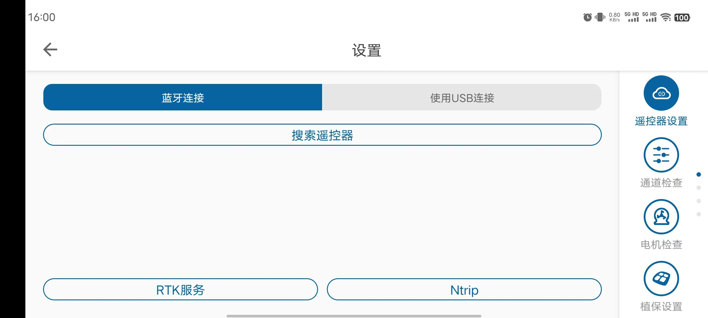
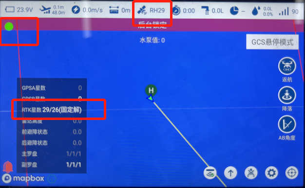
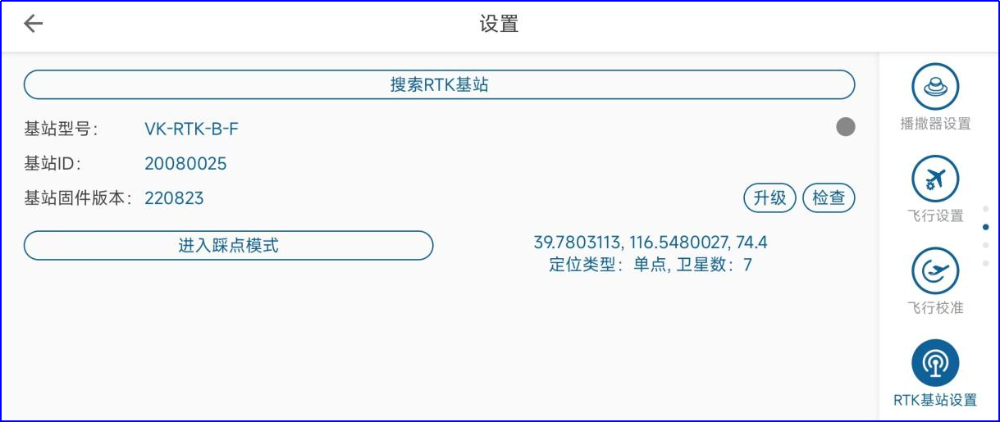
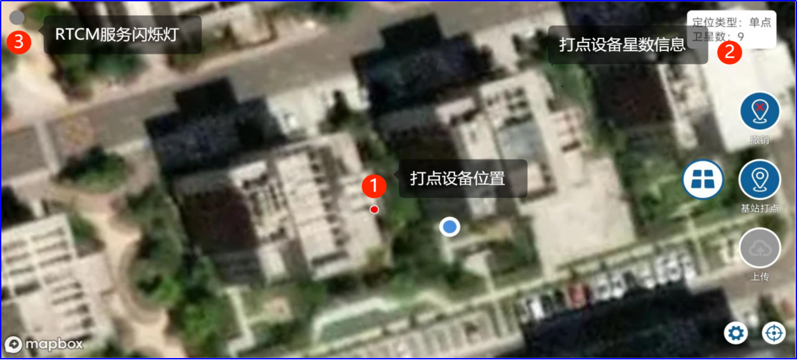

# RTK使用说明

# 连接图

 

##  设备:RTK机载端

 

RTK机载端和普通GNSS模块为飞机提供双冗余定位功能，当RTK状态为固定解时，系统使用RTK模块的定位信息；当RTK状态非固定解时，系统使用GNSS模块的定位信息。

RTK模块安装注意事项：

-   单天线RTK模块安装时箭头需要和机头方向一致
-   双天线RTK的两个天线必须是正前后（ANT1在后）或者正左右安装（ANT1在左），且天线距离大于40cm
-   RTK信号抗遮挡性不如普通GNSS，在遮挡环境会有一些搜星稳定性变差属于正常现象

##  设备:RTK移动基站

 

移动基站在没有移动网络或者没有购买千寻服务的情况下，能提供较高精度的相对定位，但绝对定位有一定的偏差，购买了千寻服务的移动基站可提供高精度的打点测绘和飞行作业，流程如下：

-   进入设置--\>RTK基站设置，搜索RTK基站
-   蓝牙连接RTK基站后，点击踩点模式，此时基站会自动接入千寻位置
-   基站定位类型显示固定解30秒后，点击将当前位置设置为基站坐标按钮，并保持基站位置不动即可提供高精度的移动基站服务。

# RTK连接说明

## 一、网络版RTK

目前有两种方式连接网络版RTK
一种是通过千寻或NTRIP如图，手动选择获取RTCM方式，通过APP转发RTCM给飞控

 

另一种是使用4G电台模块，模块内部绑定千寻，电台发送RTCM给飞控(此方式遥控器可不用联网)

登录绑定千寻的账号、或手动输入NTRIP所需信息。手机/遥控器连接网络，进入手动作业页面。

 

1、首先确认是否有绿灯闪烁，绿灯闪烁表示有RTCM信息接入。（如果不闪烁，检查网络连接或账号是否绑定千寻）
2、点击卫星图标，可看到RTK星数，定位状态分为单点、浮点解、固定解
   当标有R（固定解）时，表示飞机已进入RTK,即表示飞机进入RTK高精度定位状态。 H表示使用双天线侧向。

## 二、基站版RTK

**一**，基站用作打点器（踩点模式）

1，基站连接电池上电，通过APP-”RTK基站设置”页面搜索并连接RTK基站。蓝牙名称一般为“VKBFXXXX”

 

2，点击”进入踩点模式”。等待搜星定位。

3，进入“测绘”页面，测绘设备选择“RTK基站”，并再次连接RTK基站蓝牙。

 

地图上会显示位置，右上角显示定位类型及星数。当定位良好后可进行打点圈地操作。

**注意**：**对于给RTK基站配备了高精度服务的（国内开通了千寻服务，国外单独配备了RTCM链路的）可以让基站进入FIX固定解模式后再开始打点** **，位置更准确。**
**当提供了RTCM服务后，RTCM服务闪烁灯会闪烁，闪烁后才能进入FIX固定解。（单点定位用户不需要关注）**

4，测绘圈地完成后，RTK基站要放到固定位置，不再移动，然后重新上电。（重新上电后默认进入固定站模式，不能用于踩点圈地）。

**二**，基站作为固定站，为飞机做RTCM服务。

选定一个固定位置，固定好基站，基站需要放置在开阔的地方，并用脚架支起来，这样跟利于搜星。然后给基站连接电池上电。上电后基站默认处于固定站模式，会给飞机提供RTCM服务，可以使飞机端RTK进入高精度的FXI固定解定位状态。

（注:基站每次上电默认进入基站模式，可不用通过APP连接基站。使用基站模式时，不能移动基站）

使用基站模式时，飞机上电并连接APP，当APP手动页面卫星图标处显示“R”，或点开卫星图标显示“固定解”，即表示飞机进入RTK高精度定位状态。

 

 